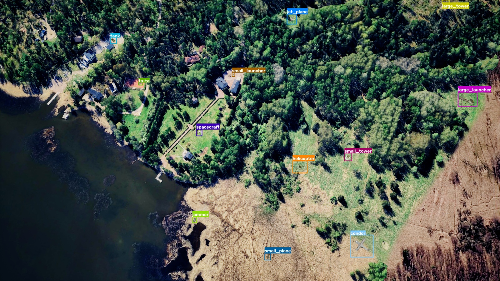
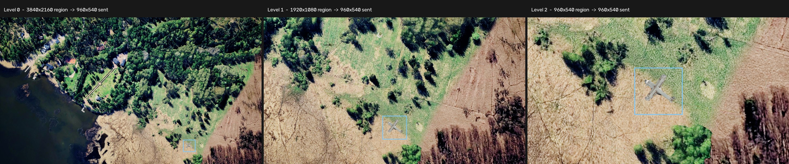

# Drone flyby

A survey drone flies a straight line 600 metres above a simulated landscape,
filming the ground as it goes. Your job is to find the objects down there —
vehicles, aircraft, towers and hangars — and say what and where they are.

The catch is that you also steer the camera. Objects are small from 600 metres,
and the image you receive is only ever 960x540, so you have to decide when to
look at the whole scene and when to zoom in on part of it. Detect well, and
steer well, and you score.



Every object in that frame is boxed. That is how small they are at full-frame
zoom, and why the camera controls matter.

## Quickstart

```cmd
git clone https://github.com/amboltio/Nordic-AI-Cup-2026
cd Nordic-AI-Cup-2026/drone-flyby
pip install -r requirements.txt
```

Serve the baseline:

```cmd
python api.py
```

Then, in a second terminal, score it against the supplied scene:

```cmd
python local_evaluator.py
```

You now have a working endpoint and a number to improve. The baseline scores
about zero — it is edge detection with a fixed label, there to prove the
plumbing works, not to compete.

Check that the harness and the data agree with each other at any time:

```cmd
python local_evaluator.py --oracle
```

That feeds the ground truth in as predictions and should print `1.000`. If it
does, a low score is your model, not your setup.

### What is in this folder

| File | What it is |
|---|---|
| `api.py` | The FastAPI server the evaluator calls. You probably will not change it. |
| `example.py` | The baseline detector and camera policy. **This is the file to replace.** |
| `dtos.py` | The request and response models, plus the protocol constants. |
| `utils.py` | Decoding, coordinate conversion, response validation, box drawing. |
| `local_evaluator.py` | Replays a scene through your endpoint and scores it. |
| `visualize.py` | Draws the ground truth onto the supplied frames. |
| `requirements.txt` | Dependencies. Loose pins, so they will not fight your detection stack. |
| `Dockerfile` | If you would rather containerise the server. |
| `src/helsinki/` | 25 reference frames with annotations. |

## About the challenge

The drone films a 3840x2160 sequence at 3 frames per second. You do not get the
4K frame. You get one 960x540 PNG per frame, showing whatever the camera is
currently pointed at.

What you send back is not limited to that crop. **You answer for the whole
source frame**, and every frame is scored against every object in it, whether or
not the camera was looking that way. The protocol is deliberately asymmetric:

```text
INPUT   the current camera crop
OUTPUT  your best prediction for the complete current source frame
```

The camera position carries over from frame to frame. 
This makes the challenge a combination of object detection and camera control: 
recognise objects in the current view, return predictions for the full source frame, and decide where the camera should point next.


## Resolution levels

The transmitted image is always 960x540. What changes is how much of the source
frame those pixels cover:

| Resolution level | Region taken from the source | Image sent | Share of the frame |
|---|---|---|---|
| 0 | 3840x2160 | 960x540 | all of it |
| 1 | 1920x1080 | 960x540 | a quarter |
| 2 | 960x540 | 960x540 | a sixteenth |



Level 0 is reduced by four in each dimension, Level 1 by two, and Level 2 is
sent at its native size. This is the central trade-off: Level 0 shows you
everything at once but throws away the detail small objects need, while Level 2
shows real pixels but only covers a sixteenth of the ground.

Cropping and upscaling a Level-0 image yourself does not recover what a
Level-1 or Level-2 view would have shown. That detail was never sent.

## Supplied data

`src/helsinki/` holds 25 reference frames from a flight over a location near
Helsinki:

- `images/` — the raw 3840x2160 frames;
- `annotations/` — one JSON per frame with object names and boxes;
- `run_metadata.json` — capture settings and how many of each object exist.

The scene contains 16 object instances, one of each class, at 600 m altitude
with 13.89 m between frames. An instance is usually visible across several
consecutive frames.

To see the annotations drawn on the frames:

```cmd
python visualize.py --frame 0          # writes annotated/frame_000000.png
python visualize.py --all              # the whole scene
python visualize.py --frame 0 --show   # in a window
```

**The supplied boxes are in source pixels — `[x1, y1, x2, y2]` at 4K.** That is
the coordinate system you are scored in, and a response uses the same geometry,
simply normalized by `original_width` and `original_height`.
`utils.source_bbox_to_global` turns one of these boxes straight into an answer.

## Your goal

Report every object you can, with the right class, a tight box and a confidence score. 
Small objects are hard to recognise in the downsampled Level-0 view, so zooming can provide more detail. 
Your response still covers the full source frame, while the camera view determines which region you observe in detail. 
The camera only moves once per frame, so where you point it is a real decision.


## What the evaluator sends you

One POST per frame, containing the image from wherever the camera currently is.

| Field | Meaning |
|---|---|
| `sequence_id` | Shared by every request in the attempt. |
| `frame` | The source frame number. Predictions are scored against it. **Echo it back.** |
| `frame_index` | Position in the sequence. Gaps here are frames you were too slow for. |
| `request_id` | Unique to this request. **Echo it back.** |
| `frame_interval_ms` | How often a frame is emitted (333). |
| `response_timeout_ms` | The budget for this one request, from the POST (3333). |
| `original_width` / `original_height` | The source frame size, always 3840 and 2160. |
| `view` | The camera position, the crop geometry, and the image. |
| `camera_constraints` | What your next camera request is allowed to be. |
| `camera_command_feedback` | Why your last camera request was ignored, or `null`. |

```json
{
  "sequence_id": "3f9c...",
  "frame": 42,
  "frame_index": 41,
  "request_id": "3f9c...:41:2:2200:900",
  "frame_interval_ms": 333,
  "response_timeout_ms": 3333,
  "original_width": 3840,
  "original_height": 2160,
  "view": {
    "resolution_level": 2,
    "center_x": 2200,
    "center_y": 900,
    "view_id": "3f9c...:41:2:2200:900",
    "image": "<base64 PNG>",
    "image_media_type": "image/png",
    "width": 960,
    "height": 540,
    "source_region_xyxy": [1720, 630, 2680, 1170]
  },
  "camera_constraints": {
    "maximum_center_delta": 551.0,
    "allowed_resolution_levels": [1, 2],
    "center_bounds": [
      {
        "resolution_level": 1,
        "width": 960,
        "height": 540,
        "minimum_center_x": 960,
        "maximum_center_x": 2880,
        "minimum_center_y": 540,
        "maximum_center_y": 1620
      },
      {
        "resolution_level": 2,
        "width": 960,
        "height": 540,
        "minimum_center_x": 480,
        "maximum_center_x": 3360,
        "minimum_center_y": 270,
        "maximum_center_y": 1890
      }
    ],
    "full_view_reset_exempt_from_delta": true
  },
  "camera_command_feedback": null
}
```

`image` is a 960x540 PNG as a Base64 string, with no `data:` prefix. PNG is
lossless, so the only quality loss is the deliberate downsample. `width` and
`height` always describe the transmitted image, never the size of the region it
came from — that is `source_region_xyxy`.

`source_region_xyxy` tells you where you are looking, and you use it to lift a
detection made on this image into the global coordinates you answer in. The
evaluator does **not** apply it to your response: it plays no part in how your
boxes are read, and it never constrains them.

Read the movement rules from `camera_constraints` rather than hardcoding them.
They already account for the level the camera is on, so honouring what you are
handed is enough to keep every command legal.

## What you send back

| Field | Meaning |
|---|---|
| `request_id` | Unchanged from the request. |
| `frame` | Unchanged from the request. |
| `annotations` | Your best prediction for the **whole current source frame**. At most 500. |
| `requested_view` | Where to point the camera next, or `null` to hold. |

Each annotation needs:

| Field | Meaning |
|---|---|
| `object_id` | One of the accepted names, case-sensitive. |
| `bbox` | `[x1, y1, x2, y2]`, normalized to the full source frame. |
| `confidence` | Between 0 and 1. |

```json
{
  "request_id": "3f9c...:41:2:2200:900",
  "frame": 42,
  "annotations": [
    {
      "object_id": "jammer",
      "bbox": [0.5479, 0.4167, 0.5629, 0.4317],
      "confidence": 0.87
    },
    {
      "object_id": "hangar",
      "bbox": [0.10, 0.20, 0.18, 0.26],
      "confidence": 0.64
    }
  ],
  "requested_view": {
    "resolution_level": 2,
    "center_x": 2500,
    "center_y": 1000
  }
}
```

The `jammer` sits inside the Level-2 crop this request carried. The `hangar` is at
source `(384, 432)` to `(691, 562)`, outside that crop, and is a valid
annotation: a response covers the whole source frame.

### Boxes are global

**Boxes are normalized to the full source frame, not to the image you
received.** Divide by `original_width` and `original_height`:

```text
global_x = source_x / original_width     # 3840
global_y = source_y / original_height    # 2160
```

A box at source x = 1920 is `0.5` whatever the resolution level and wherever
the camera happens to be pointed. The evaluator reads your answer by scaling
straight back:

```text
source_x = global_x * original_width
source_y = global_y * original_height
```

```text
local detection in the 960x540 view
  -> map through source_region_xyxy    (source pixels)
  -> divide by original_width / original_height
  -> report as a global annotation
```

`utils.view_bbox_to_global` does all three steps in one call.

At **Level 0**, the crop covers the full source frame, so view and global normalized coordinates are identical. At **Level 1** and **Level 2**, the conversion is required.

### A worked Level-2 example

For a Level-2 request with centre `(2200, 900)`,
`source_region_xyxy` is `[1720, 630, 2680, 1170]` — a 960x540 region sent at
native size.

Your detector finds a jammer in that image at normalized view coordinates
`[0.40, 0.50, 0.46, 0.56]`. Convert it:

```text
1. view -> source, through source_region_xyxy (960x540 region at 1720, 630):
     x1 = 1720 + 0.40 * 960 = 2104.0        y1 = 630 + 0.50 * 540 = 900.0
     x2 = 1720 + 0.46 * 960 = 2161.6        y2 = 630 + 0.56 * 540 = 932.4

2. source -> global, through original_width / original_height:
     x1 = 2104.0 / 3840 = 0.5479            y1 = 900.0 / 2160 = 0.4167
     x2 = 2161.6 / 3840 = 0.5629            y2 = 932.4 / 2160 = 0.4317
```

```python
from utils import view_bbox_to_global

view_bbox_to_global([0.40, 0.50, 0.46, 0.56], [1720, 630, 2680, 1170], 3840, 2160)
# (0.5479, 0.4167, 0.5629, 0.4317)
```

## Camera movement

You do not send `pan left`. You send the absolute centre you want next, in
source coordinates, and the level you want it at.

| Level | Valid `center_x` | Valid `center_y` |
|---|---|---|
| 0 | 1920 | 1080 |
| 1 | 960–2880 | 540–1620 |
| 2 | 480–3360 | 270–1890 |

These bounds keep the crop inside the frame. Requests outside them are not
clipped or nudged into range — they are ignored.

Level changes are restricted to one step at a time:

- Level 0 to Level 0 or 1
- Level 1 to Level 0, 1 or 2
- Level 2 to Level 1 or 2

**Level 0 and Level 2 cannot reach each other directly**, in either direction.
Going from the closest zoom back to the full view takes two frames. A request
for Level 0 must use the centre `(1920, 1080)`, and is the one move exempt from
the distance limit below.

Otherwise a move is limited by how far the centre travels:

```text
distance = sqrt((new_x - old_x)^2 + (new_y - old_y)^2)
```

| Current level | Maximum centre movement |
|---|---|
| 0 | 2203 px |
| 1 | 1102 px |
| 2 | 551 px |

The limit comes from the level the camera is on **now**, even when you change
level and centre in the same response. Each limit is half the diagonal of that
level's view, so a full diagonal move lands the requested centre on the current view's corner, 
leaving roughly a quarter of the area overlapping.

Since a response carries at most one camera command, and you get one request
per frame, **the camera moves at most once per frame**.

### When a camera command is refused

An illegal level change, an out-of-bounds centre or an over-long move is
ignored. The camera stays where it was, and — importantly — **the detections in
that same response are still scored.** A bad camera command costs you the move,
not the frame.

The reason comes back in `camera_command_feedback` on every following frame
until you send something usable, so it still reaches you if the next frame gets
skipped. `utils.describe_camera_rejection` runs the same three checks locally.

## Timing

Frames are emitted every 333 ms whether you are ready or not, and each request
has a 3333 ms budget from the POST.

Those two numbers mean something specific:

- **A slow answer is not thrown away.** Its detections still count, for the
  frame whose image it described.
- **What a slow answer costs is the frames that went by while you were busy.**
  Only the newest emitted frame is ever sent, so at 3 fps a 700 ms round trip
  means roughly every second frame never reaches you.
- **A frame you never see is scored as a frame with no detections.** Its ground 
truth still counts, so skipped frames cost recall.
- A request that exceeds the 3333 ms budget is abandoned and recorded as an error.

Gaps in `frame_index` indicate which frames were skipped.

## Object types

```text
condor, hangar, helicopter, jammer, jet_plane, large_launcher,
large_tower, medium_launcher, medium_plane, mine_roller, small_launcher,
small_plane, small_tower, spacecraft, ta-ta, tank
```

Names are case-sensitive and must match exactly. `dtos.OBJECT_CLASSES` has them
in the order the scorer uses.

## Scoring

Your score is **COCO mAP at IoU 0.50**, between 0 and 1.

Before scoring, all accepted bounding boxes are converted to source-frame coordinates by multiplying by `original_width` and `original_height`. This conversion is independent of the current camera view.

Each frame is scored against every ground-truth object in that frame, not only the objects inside the current `source_region_xyxy`. Frames that are skipped or unanswered contribute no detections.

Faster-COCO-Eval then calculates AP at IoU 0.50. AP is calculated for each class represented in the dataset and macro-averaged.

There is no non-maximum suppression. Overlapping duplicate predictions for the same object are counted as false positives, so suppress duplicates before answering.

False positives reduce precision, missed objects reduce recall, and a prediction below IoU 0.50 with the ground truth does not count as a detection. Confidence determines the order in which predictions are considered during evaluation.


## Validation and evaluation

Everything happens through [cases.nordicaicup.com](https://cases.nordicaicup.com) with the API
key your team was given.

**Verify** sends a single full-frame request and checks the shape of your reply.
It is a format check, not a speed check — verification allows 30 seconds, while
a real attempt allows 3333 ms per request. Passing it does not mean you are fast
enough.

**Validation** runs a 249-frame sequence. You can only have one attempt going at
a time, but you can validate as often as you like. You are allowed to record and
keep the validation sequence.

**Evaluation** runs a different 250-frame sequence, and you get
**one completed attempt only**. That score is the one you are judged on. 

The 25 supplied Helsinki frames are reference and training data. They are not
the validation set, and the evaluation set is different again — so do not
overfit to what you can see.

## Test locally

`local_evaluator.py` replays a supplied scene through your endpoint using the
same crops, the same payloads, the same camera rules and the same scorer as the
competition.

```cmd
python local_evaluator.py                              # every frame, no clock
python local_evaluator.py --realtime                   # with the 3 fps clock
python local_evaluator.py --realtime --simulate-latency-ms 400
python local_evaluator.py --oracle                     # score the ground truth
python local_evaluator.py --verbose                    # log every frame
```

The two modes answer different questions. The default sends every frame and
waits, which measures your detector. `--realtime` runs the clock and drops
frames you were too slow for, which measures your score. Comparing them tells
you whether to spend your effort on accuracy or on latency.

`--simulate-latency-ms` pretends your server is slower than it is, which is the
cheap way to find out how much headroom you have before frames start
disappearing.

Helsinki holds a single instance of each class across 25 frames, so the absolute
number is noisy. Treat it as a correctness harness first and a benchmark second.

## Serve your endpoint

Serve your endpoint locally and test that everything starts without errors:

```cmd
cd drone-flyby
python api.py
```

Open a browser and navigate to http://localhost:9053. You should see a message
stating that the endpoint is running. Feel free to change the `HOST` and `PORT`
settings in `api.py`.

There is also a `Dockerfile` if you would rather containerise it:

```cmd
docker build -t drone-flyby .
docker run -p 9053:9053 drone-flyby
```

### Make your endpoint reachable

The evaluation service has to be able to call you from the internet.

- **Cloud instance** — run the same steps on a VM from UCloud, Azure, GCP or
  AWS and open the port. This is the path we would recommend.
- **Local machine** — you need the port forwarded to your machine, which
  depends on your router and is often not possible on a university network.

**Get a server up and reachable early in the competition.** If something is
wrong with your deployment, you want to find out on day one and not an hour
before the deadline.

**The URL you submit is used exactly as given, path included.** With the
`api.py` in this folder that means `http://<your-host>:9053/predict`, not just
the host.

## OBS

Things that quietly cost people points:

* **One bad box loses the whole frame.** A box must satisfy `0 <= x1 < x2 <= 1` and `0 <= y1 < y2 <= 1` strictly, measured against the full source frame. A box clipped to the frame edge until it has zero width or height fails validation, and the response is rejected with every other detection in it. `utils.clip_bbox_to_frame` returns `None` for these cases, and `utils.validate_response` catches invalid responses before they leave your server.
* **Boxes are global.** Bounding boxes must be normalized to the full source frame, not to the 960x540 image you received. At Level 1 and Level 2, a box normalized to the transmitted view may still pass validation but will be interpreted at the wrong position in the source frame. Use `utils.view_bbox_to_global` when converting detections from the current view.
* **`requested_view` must contain integers.** `2500.0` is not `2500`. Round and cast camera coordinates before returning them.
* **No unknown fields.** The response schema rejects fields it does not recognise, so do not add debugging keys to the payload.
* **Echo `request_id` and `frame` exactly.** A mismatch is treated as an invalid response.
* **An unknown or misspelled `object_id` fails the response.** Use only values from `dtos.OBJECT_CLASSES`.
* **Do not let your model raise an exception.** An exception means no response, and the frame is scored with no detections. Catch errors and return a valid response whenever possible.
* **Warm up your model before the attempt starts.** The first inference is often the slowest, and there is no additional timing allowance for it.
