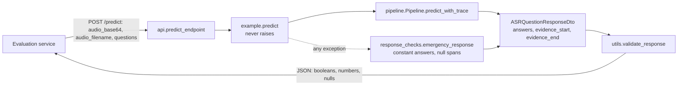
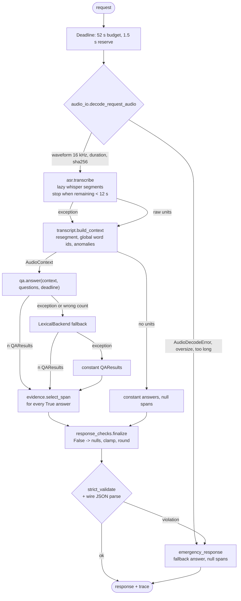
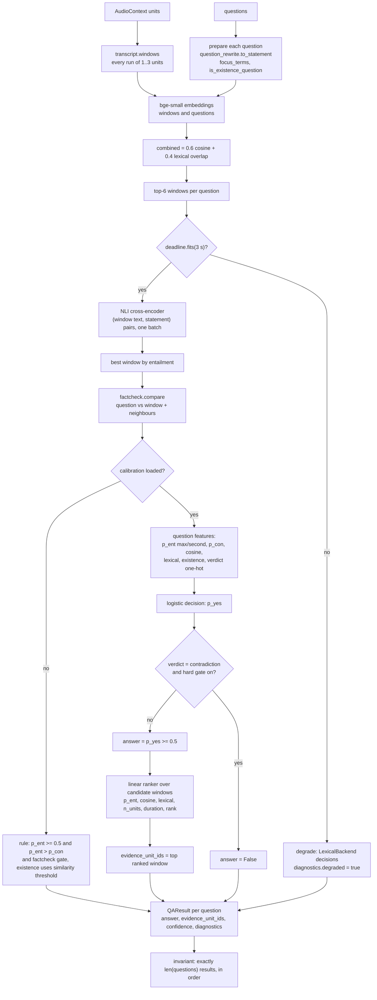
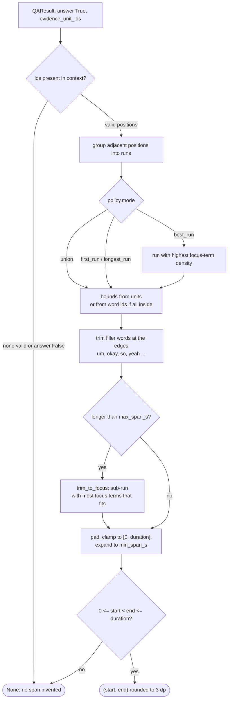
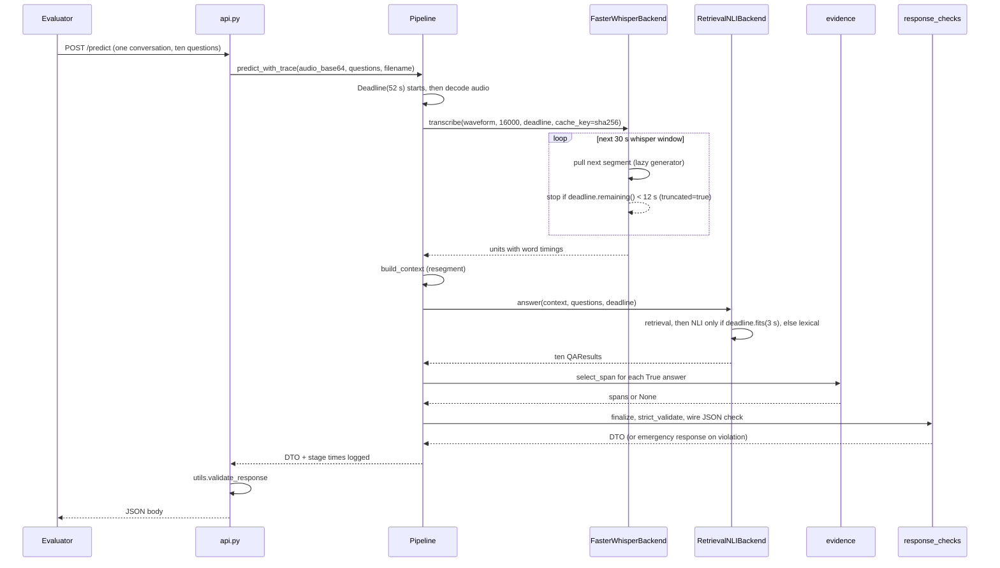
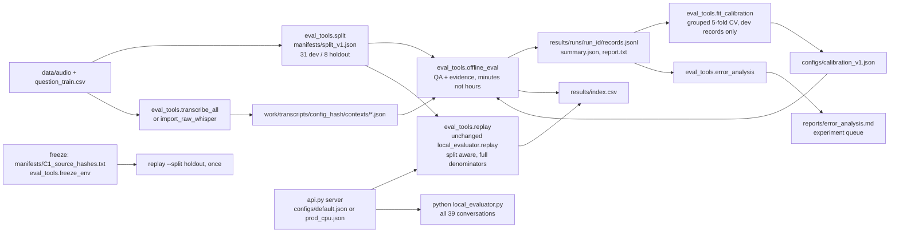
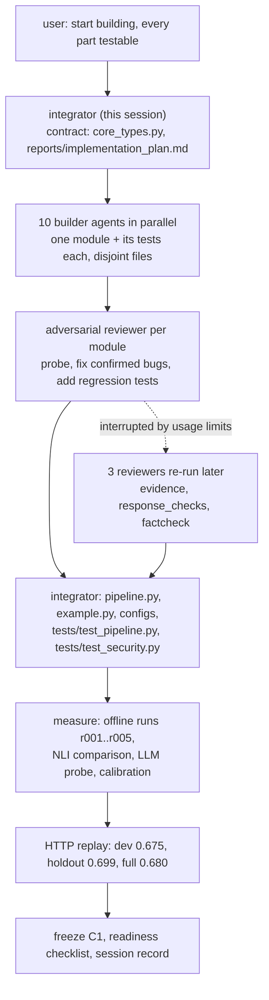

# Control flow diagrams

Mermaid diagrams of the system at three levels: the request path as the
evaluator sees it, the pipeline's stage sequencing with its fallback ladder,
and the internals of the QA and evidence stages. The last two diagrams show
the development loop (offline evaluation, calibration, replay) and the
multi-agent build workflow used in the session. Render with any Mermaid
viewer (GitHub, VS Code, mermaid.live).

## 1. High level: one request

## 2. Pipeline stages and fallback ladder

## 3. QA stage: RetrievalNLIBackend

## 4. Evidence stage: unit ids to seconds

## 5. One request in time: deadline handling

## 6. Development loop: offline evaluation, calibration, replay

## 7. Build workflow used in the session

